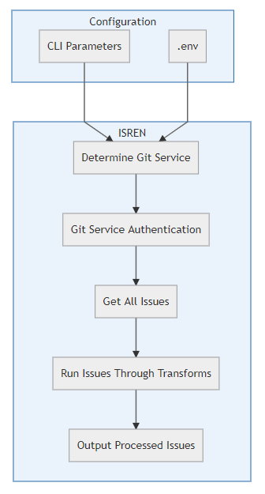

# ISREN

`IS`sue `R`endering `EN`gine

ISREN is a tool aimed at providing an easy interface for pulling issue data out
of a hosted Git implementation. ISREN will pull all of the issues for the given
`<hosted_git_url>` provided at run-time. For repeatable data transformations, a
[transform](#transforms) system is available for writing custom middleware.

```bash
$ isren -h

Usage: isren [options] <hosted_git_url>

isren - ISsue Rendering ENgine

Options:
  -v, --version                          output the version number
  -a, --auth <token>                     Hosted git API authentication token
  -k, --insecure                         Ignore SSL certificate check
  -d, --debug                            Enable debug mode
  -t, --transform <transform file path>  Path to custom transform file
  -o, --out <Output file format>         The format of output file
  --out-options <Output options>         Additional options for output configuration
  --issue-options <Issue options>        Additional options for the Issue pulling
  -f, --file <Output file path>          The path of output file
  -h, --help                             output usage information
```

#### Examples

Output a CSV file:

```bash
$ isren -o csv,file -f output.csv https://gitlab.com/mygroup/exampleproject
```

Use a custom transform and output a JSON file:

```bash
$ isren -f /path/to/transform.js -o json,file -f output.json https://gitlab.com/mygroup/exampleproject
```

## Documentation

- [Data Flow](#data-flow)
- [Configuration](#configuration)
  - [.env](#env)
    - [Available .env variables](#available-env-variables)
- [Options](#options)
  - [Version](#version)
  - [Authentication](#authentication)
  - [Insecure](#insecure)
  - [Debug](#debug)
  - [Transform](#transform)
  - [Output](#output)
  - [Output Options](#output-options)
  - [Issue Options](#issue-options)
  - [File](#file)
  - [Help](#help)
- [Transforms](#transforms)

#### Additional Docs

- [Setup](/docs/setup.md)
- [Contributing](CONTRIBUTING.md)

## Data Flow

Data flow within ISREN can be visualized with the following graphic. For every
change to the internals, the graphic should be updated, see
[CONTRIBUTING.md](CONTRIBUTING.md)



## Configuration

Configuration for ISREN is controlled by CLI parameters and/or a `.env` file.
CLI parameters override any configuration set inside your `.env`, so params can
be used for one-off changes to normal runs of ISREN.

### .env

To get started with a `.env` file, you can copy the `.env.example` file:

```bash
$ cp .env.example .env
```

#### Available .env variables

- `AUTH`
  - The auth token to use
- `GITLAB_URL`
  - An override for custom GitLab urls, used for private enterprise versions of
    GitLab.
- `DEBUG`
  - Enables additional debug logging.
- `ISSUE_OPTIONS`
  - See [Option: Issue Options](#issue-options)
- `OUTPUT_OPTIONS`

  - See [Option: Output Options](#output-options)

## Options

### Version

`-v, --version`

- Get the current version of ISREN

### Authentication

`-a, --auth`

- Set the authentication token for the session

### Insecure

`-k, --insecure`

- Allow insecure/self-signed ssl certificates

### Debug

`-d, --debug`

- Enable debug logging

### Transform

`-t, --transform`

- Enable one or many (csv delimited) transforms for the session

### Output

`-o, --out`

- Configure the output mode(s), available options:
  - CSV
    - input: array
    - output: string
  - JSON
    - input: array
    - output: string
  - Console
    - input: any
    - output: any (whatever was input)
  - File
    - input: any
    - output: any (whatever was input)

> Note: The order of the outputs is important! Data flows from the first defined
> output to the last, each output requires that the preceding output returns
> expected input data. Because of this, some outputs cannot be used together,
> the input/output must match for each output, e.g. `-o csv,file` works, but
> `-o csv,json` does not.

### Output Options

`--out-options`

- Enable additional output options for the session

  - Additional output file options, currently only used for CSV export types.
    This value is expected to be a valid JSON object using
    [these options](https://csv.js.org/stringify/options/#available-options).
    For example, to change the CSV delimiter to `|`:

    ```bash
    // CLI
    --out-options='{"delimiter": "|"}'

    // .env
    OUTPUT_OPTIONS={"delimiter": "|"}
    ```

### Issue Options

`--issue-options`

- Additional filtering for issue fetching. This value is expected to be a
  valid JSON object using
  [these filtering options](https://github.com/gitlabhq/gitlabhq/blob/master/doc/api/issues.md#list-issues).
  For example, to filter based on creation date:

  ```bash
  // CLI
  --issue-options='{"created_after": "2019-08-01T00:00:00.000Z"}'

  // .env
  ISSUE_OPTIONS={"created_after": "2019-08-01T00:00:00.000Z"}
  ```

### File

`-f, --file`

- The output file name and path.
  - Only used when the [Output](#output) file option is included

### Help

`-h, --help`

- Display the help output.

## Transforms

Transforms are a powerful concept in ISREN that allow us to _transform_ issues,
one at a time, to shape the internal data into a format that better serves us.

For example, given the following example issue:

```JSON
{
  "id": 12345,
  "description": "lorem ipsum ..."
}
```

If we wanted to re-key the `id` to say `issue_id`, we can use write the
following transform

```javascript
// MyTransform.js
//
// usage:
// $ isren --transform path/to/MyTransform.js
(function(issue) {
  // Add/edit our new field.
  issue.issue_id = issue.id;

  // Delete the old field
  delete issue.id;

  // Return the modified issue.
  return issue;
});
```

When a transform, one or more, is provided, each issue is run through the
transform before it goes through the output method, another type of transform!
Currently, only synchronous transforms are supported.
